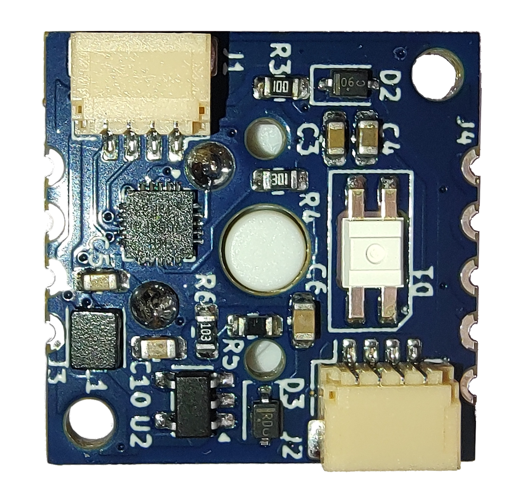
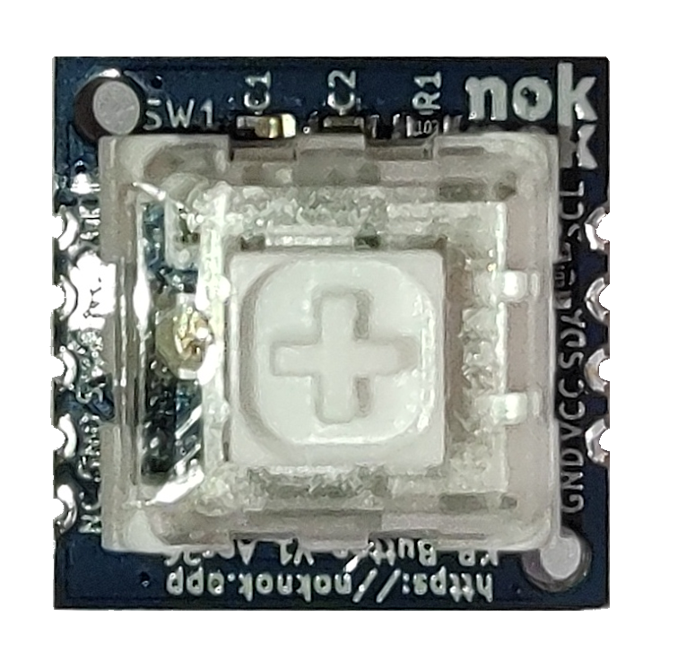

# noknok LED Button

A compact I²C‑controlled button module with integrated RGB LED backlight for the noknok ecosystem.  
Designed for user input, menu navigation, and illuminated UI feedback in modular builds.




---

## Overview

The **noknok LED Button** uses a **CH32V003F4U6** microcontroller to read a tactile push button and drive an **SK6812MINI-E** RGB LED via SPI+DMA. It connects to the Raspberry Pi Pico (Conductor) over the standard noknok **JST SH 4‑pin I²C connector**.

The I²C address is assigned dynamically at boot — no conflicts when using multiple modules on the same bus.

Typical use cases:
- Menu selection (OK / Back / Cancel)
- Illuminated status indicators
- Multi‑button control panels
- Confirm actions with colour feedback

---

## Features

- Dynamic I²C address via noknok enumeration protocol (no hardcoded address)
- CH32V003F4U6 microcontroller (RISC‑V, 48 MHz, QFN-20)
- SK6812MINI-E RGB LED (SPI + DMA driven — CPU-free updates)
- Tactile push button with 20 ms hardware debounce
- Press edge, release edge, and cumulative press count — no polling gaps
- 3.3V operation via noknok I²C connector
- Compact 20×20 mm PCB

---

## I²C Protocol

**I²C address:** assigned dynamically at boot — see [Enumeration](#enumeration).

### Commands (Pico → Module)

| Bytes | Command | Description |
|-------|---------|-------------|
| `0x00` | **LED OFF** | Turn LED off immediately |
| `0x10` `R` `G` `B` `0x00` | **SET COLOR** | Set LED colour (R, G, B each 0–255) |
| `0x11` | **RESET COUNT** | Reset cumulative press counter to 0 |
| `0xB0` | **ENTER BOOTLOADER** | Reset into the I²C bootloader for an over‑the‑wire firmware update (see [Firmware](#firmware)) |
| `0xB1` | **GET VERSION** | Standard noknok command — the next read returns 4 version bytes (see below) |

### Version read (Pico ← Module)

`GET_VERSION` (`0xB1`) is a **noknok ecosystem-standard** command (the `0xB0`–`0xBF` range is reserved for standard commands across every module). Write `0xB1`, then read **4 bytes**: `[PROTOCOL_VERSION, FW_MAJOR, FW_MINOR, FW_PATCH]` = `[0x01, 2, 2, 0]`. Lets the Conductor compare the installed version against the version required by the product manifest. **→ Full spec:** [Ecosystem / software / readme.md §5](https://github.com/buildwithnoknok/Ecosystem/blob/main/software/readme.md#5-standard-system-commands)

### Status read (Pico ← Module)

Read **2 bytes**:

**Byte 0 — status flags:**

| Bit | Meaning |
|-----|---------|
| 0 | Button currently pressed (`1` = held down) |
| 1 | Press event since last read (edge, auto-clears) |
| 2 | Release event since last read (edge, auto-clears) |

**Byte 1 — cumulative press count** (0–255, wraps)

> Edge flags (bits 1 and 2) are cleared on the module after each read. Poll at ~50 ms and you won't miss any press or release.

---

## Enumeration

The module uses the standard noknok dynamic enumeration protocol — no hardcoded I²C address. At boot it flashes the LED white briefly, then counts a UID-derived backoff delay before joining the bus at `0x7F` for address assignment. On successful assignment, the LED flashes green.

**→ Full protocol spec:** [Ecosystem / software / enumeration.md](https://github.com/buildwithnoknok/Ecosystem/blob/main/software/enumeration.md)

---

## Python API

Use the `noknok.py` library from the [Ecosystem repo](https://github.com/buildwithnoknok/Ecosystem/tree/main/software/pico) on the Pico.

```python
from noknok import Conductor

c = Conductor()        # GP8 = SDA, GP9 = SCL
c.enumerate()          # discover all modules (~3 s)

kb = c.ledbutton[0]             # first LED Button by discovery order
# or: kb = c.role["ok_button"]  # by role name after setup_roles()

# LED control
kb.set_color(255, 0, 0)         # red
kb.set_color(0, 255, 0)         # green
kb.set_color(255, 255, 255)     # white
kb.led_off()

# Button reading — returns LedButtonStatus or None on I2C error
s = kb.read()
if s is not None:
    print(s.pressed)        # True if held right now
    print(s.press_event)    # True if pressed since last read
    print(s.release_event)  # True if released since last read
    print(s.count)          # cumulative press count (0–255)

# Reset counter
kb.reset_count()
```

---

## Hardware

| Spec | Value |
|------|-------|
| PCB size | 20 × 20 mm |
| MCU | CH32V003F4U6 (QFN‑20, RISC‑V, 48 MHz) |
| LED | SK6812MINI-E (RGB, SPI-driven) |
| Button | Tactile switch, active LOW, internal pull-up |
| Connector | JST SH 4‑pin (Qwiic / Stemma QT compatible) |
| Supply voltage | 3.3V via I²C connector |
| LED data pin | PC6 (SPI1 MOSI, DMA-driven) |
| Button pin | PD4 (active LOW) |
| I²C SDA | PC1 |
| I²C SCL | PC2 |
| Flash header | J4 — 5‑pin (GND, SWIO, RST, VCC) |

---

## Firmware

**v2.2 runs under the shared noknok I²C bootloader** ([module-I2C-bootloader](https://github.com/buildwithnoknok/module-I2C-bootloader)), so the module can be re‑flashed **over the I²C bus** — no SWDIO cable needed in the field.

Flash map (16 KB):

| Region | Address | Written by |
|--------|---------|-----------|
| Bootloader (4 KB) | `0x0000` | SWD, **once** at manufacture |
| Application (this firmware) | `0x1000` | I²C OTA |
| Metadata (validity marker) | `0x3FC0` | I²C OTA |

The application is linked at the `0x1000` offset (`app.ld`) and reserves the top 16 bytes of RAM for the bootloader handoff cell. Command `0xB0` drops the running module back into the bootloader for an update.

### Build

```bash
cd firmware/src
make build   # compile the offset-linked application -> keyboard_firmware.bin
```

> ch32fun must be installed at `../ch32fun/` relative to `firmware/src/` — see [cnlohr/ch32v003fun](https://github.com/cnlohr/ch32v003fun) for setup.

### Flashing

- **Normal (over I²C):** flash `keyboard_firmware.bin` from the Pico using the noknok flasher (`module_flasher.py` in `brain-Pico`). No cable.
- **First time / blank board:** SWD‑flash the bootloader once (`make flash` in the bootloader repo), then flash this app over I²C.
- **Backup / recovery (SWD):** the 5‑pin SWIO header is the unbrickable backstop — see *Recovery & SWD flashing* in the [bootloader README](https://github.com/buildwithnoknok/module-I2C-bootloader#recovery--swd-flashing).

`make flash` here still does a one‑off SWD flash of the app for bench bring‑up if you need it.

| Metric | Value |
|--------|-------|
| Firmware version | v2.2 (bootloader‑hosted) |
| Application size | ~3.0 KB (of 11 KB app region) |

---

## Changelog

### v2.2.0 — SK6812 LED driver fix
Replaced the hand-rolled SPI+DMA SK6812 driver with cnlohr's proven
[`ws2812b_dma_spi_led_driver.h`](https://github.com/cnlohr/ch32fun/blob/master/extralibs/ws2812b_dma_spi_led_driver.h)
(ch32fun `extralibs`). The old driver produced a **marginal waveform** that
genuine-but-less-tolerant SK6812 lots misread — one batch showed wrong colours
(a spurious green channel) on ~13 of 20 units. This was **initially misdiagnosed
as bad/counterfeit LEDs; the LEDs are genuine OPSCO** — the fault was our driver.
The library produces a clean, glitch-free waveform. Four concrete differences vs.
the old driver:

- **16-bit SPI** transfers (was 8-bit) — cleaner framing, fewer inter-word gaps
- **`SPI1->HSCR = 1`** high-speed read mode (was not set)
- **`DMA_Priority_VeryHigh`** (was medium) — prevents inter-byte gaps under bus contention
- **`SPI1->DATAR = 0`** to force the data line low before the first frame (kills the start-of-frame glitch)

Still DMA (no bit-bang), so it never blocks the I²C / TIM2 interrupts. Wire order
(G, R, B) and the I²C command set are unchanged, so it's a drop-in OTA update.

### v2.1.0 — bootloader-hosted
Offset-linked at `0x1000` to run under the shared noknok I²C bootloader, enabling
I²C OTA firmware updates. Added the `GET_VERSION` (`0xB1`) standard command.

---

## Status

| Area | Status |
|------|--------|
| Hardware | v1.0 |
| Firmware | **v2.2 — complete (bootloader‑hosted, I²C OTA bench‑proven)** |
| Python library | **complete** (in [Ecosystem repo](https://github.com/buildwithnoknok/Ecosystem/tree/main/software/pico)) |
| Documentation | **complete** |

---

## License

- Firmware / code: MIT — see [LICENSE](LICENSE).
- Hardware (schematics, PCB layout, fab files): CC BY-SA 4.0 — see [LICENSE-hardware](LICENSE-hardware).

---

## Safety & Liability

noknok hardware is an electronic device and a DIY/maker kit. You assemble, modify, flash, power, and operate it at your own risk, and it is provided as is, without warranty. See the full notice: [License, Safety & Liability](https://buildwithnoknok.github.io/safety-and-license/).
